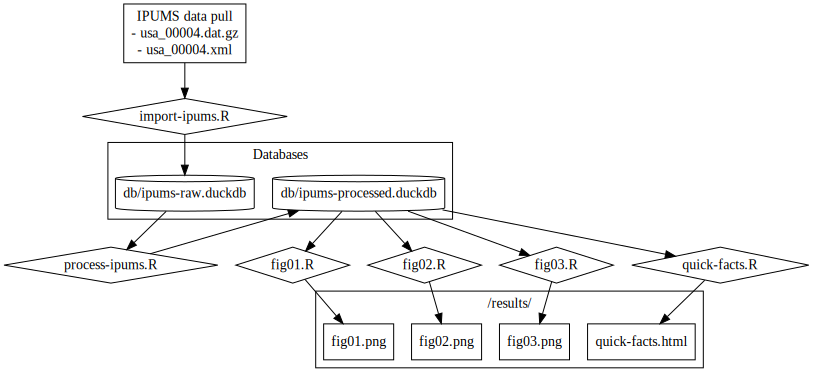
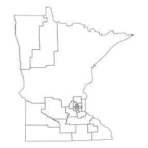

# Introduction

The purpose of this project is to analyze the extent to which demographic changes in the U.S. population can account for changes in average American household size since 2000. The methodology, based upon [Galster (2024)](#galster2024), is to construct a multidimensional matrix, with each cell representing a unique combination of demographic (age, sex, race, etc) and geographic (PUMA) characteristics. The value in each cell represents the average household size among persons with that characteristic in the year 2000. The methodology is then applied to data from the year 2020 to determine which demographic groups have the largest changes.

The project uses American Community Survey (ACS) IPUMS microdata, which are freely available to the public after registering for an API key.

# Project Structure
## File

The following is an overview of the project's file tree:

```
household-size/
├── README.md                       # The document you're currently reading
├── household-size.Rproj            # RStudio project file
├── renv/                           # R environment directory
│   ├── activate.R             
│   ├── settings.dcf           
│   └── library/               
├── src/                            # Source code directory
│   ├── utils/                      # Helper functions for other scripts
│   │   ├── aggregation-tools.R     # Functions for aggregating observations
│   │   ├── bucketing-tools.R       # Functions for bucketing observations by age, income, etc
│   │   ├── data-validation.R       # Functions for validating data during the pipeline
│   │   ├── graphing-tools.R        # Functions to help graphing
│   │   └── create-synthetic-data.R # For testing? Maybe move to tests/
│   └── scripts                     # Scripts that execute the analysis
│       ├── import-ipums.R          # Imports raw data and saves to database
│       ├── process-ipums.R         # Adds bucket and other cols, saves to database
│       ├── fig01.R 
│       ├── fig02.R
│       ├── ...
│       ├── quick-facts.R           # Produces quick statistics from our paper
│       └── proof-of-concept-bucketing.R # May be deprecated soon
│   
└── tests/                          
    ├── testthat/                   # Unit tests
    │   ├── test-difference-means.R
    │   ├── test-join-columns-db.R
    │   ├── test-join-columns-tb.R
    │   └── ...
    └── test-data/                  # Mock data for unit tests
        ├── mock_data.csv
        ├── mock_age_lookup.csv
        ├── mock_income_lookup.csv
        ├── expected_age_output.csv
        └── expected_income_output.csv

```
## Data Flow Diagram



# Project Setup

The project is set up as an R project with `renv` to manage dependencies. When you open the project in RStudio, `renv` will automatically load the required environment, and you will have access to the correct versions of all the necessary packages.

## If you're running the code for the first time...

1. Sign up for an IPUMS account and obtain an API key.

2. Clone the repository:

    ```sh
    git clone https://github.com/lorae/household-size.git
    ```

3. Open the R project file (`household-size.Rproj`) in RStudio. 

4. Verify that [RTools](https://cran.r-project.org/bin/windows/Rtools/) is already installed on your computer. RTools is required for compiling some of the packages in this project's library.

    a. Load the `pkgbuild` package, installing if necessary:

        ```r
        if (!requireNamespace("pkgbuild", quietly = TRUE)) {
          install.packages("pkgbuild")
        }
        library("pkgbuild")
        ```

    b. Use the `find_rtools()` function from the `pkgbuild` package to verify that RTools is installed and configured.

        ```r
        pkgbuild::find_rtools()
        ```

        If the output is `[1] TRUE`, RTools is installed and ready to use. Proceed to step 5.
        
        If the output is `[2] FALSE`:
        
          i. Verify your current version of R by running 
          
              ```r 
              R.version.string
              ```
          ii. Navigate to https://cran.r-project.org/bin/windows/Rtools/. Download the version of RTools consistent with your version of R: For example, install RTools44 for version 4.4.0 and above, and RTools43 for version 4.3.0 and above.
          
          iii. Close any instances of R and RStudio and open the executable to follow installation instructions. Once downloaded, reopen RStudio rerun the above steps to verify proper RTools installation. 

5. Install the `renv` package by running the following command in R:

    ```r
    install.packages("renv")
    ```

6. Run `renv::restore()` to install all the required packages as specified in the `renv.lock` file:

    ```r
    renv::restore()
    ```

    This will ensure that your environment is set up with the same package versions used in the project.
  
7. Run the main script to perform the analysis. 

   [TODO: instructions here]

8. View the results as needed.

## If you're running the code any subsequent time...

1. Open the R project file (`household-size.Rproj`) in RStudio.

2. Run `renv::restore()` to install all the required packages as specified in the `renv.lock` file:

    ```r
    renv::restore()
    ```

    This will ensure that your environment is set up with the same package versions used in the project.
  
3. Run the main script to perform the analysis. 

   [TODO: instructions here]

4. View the results as needed.

# FAQ

1. **How granular is this analysis, geographically?**

    The Census Bureau divides the United States into [Public Use Microdata Areas (PUMAs)](https://www.census.gov/programs-surveys/geography/guidance/geo-areas/pumas.html). They're designed to collectively cover the entire U.S. population, not cross state boundaries, and "contain no fewer than 100,000 people each." There are roughly 2,000 PUMAs total.
    
    Due to migration and demographic shifts, the Census Bureau is continually redrawing the boundaries of its PUMAs. This can pose a challenge for comparing values in the same region over multiple years. Luckily, for this purpose, the Bureau also defines [Constant Public Use Microdata Areas (ConsPUMAs, or CPUMAs)](https://usa.ipums.org/usa-action/variables/CPUMA0010#description_section) for various date ranges. The ConsPUMAs we use in this analysis are CPUMA0010, which "represents areas that are consistent among 2000 and 2010 PUMAs" and "can be consistently identified from the geographic codes available in U.S. Census PUMS from 2000 to 2021 samples."
    
    Compared to PUMAs, ConsPUMAs are larger: there 1,085 ConsPUMAS defined in CPUMA0010. The land area of these ConsPUMAs varies widely: in unpopulated regions, they can be quite large, while in populated regions they can be quite small. In Minnesota, for example, the smallest ConsPUMA encompass only a small portion of Minneapolis, while the largest ConsPUMA encompasses much of the state.
    
    

2. **How granular is this analysis, demographically?**

    The variables we use to bin individuals into groups are the following. See our codebook [link to codebook] for more information.

    **Age**: 5-year bins:
    - 0-4 years
    - 5-9 years
    - 10-14 years
    - 15-19 years
    - 20-24 years
    - 25-29 years
    - 30-24 years
    - ...
    - 75-79 years
    - 80-84 years
    - 85+

    [perhaps a table of how many individuals fall in each age group?]

    **Race**: Add info here

    **Household income**: Add information here on how it's defined, whether it's pre-tax/transfer, whether it's only earned or earned and unearned, how it's deflated to compare over time, etc.

# Unit Testing

Tests are located in the `tests/testthat` folder. To run all tests:
```r
library("testthat")
test_dir("tests/testthat/")
```

# Performance Testing

Ad hoc performance tests can be run suing the `profvis()` function in the `profvis` package. For example, to test the performance of `main.R`, run:

```r
library("profvis")
profvis(source("main.R"))
```
# Data Validation

As we process the data, we run several tests to validate that the pipeline is working as expected. The module containing these validation functions is located at `src/utils/data-validation.R`.

Current data checks include:

- **Row count validation during data bucketing:**. After the IPUMS data is read and loaded into the database, the number of observations is recorded in `obs_count`. Subsequent data bucketing steps are validated against this expected count using the `validate_row_counts()` function. If any rows are unexpectedly dropped, execution will stop, and an error will be raised.

# Project convention

In this project, variables representing data are assigned suffixes based on the following convention:

- `_tb` for tibbles stored in the R global environment.
- `_db` for tables stored within a database connection.

For example, `ipums_raw_tb` would represent a tibble of raw IPUMS data; `ipums_raw_db` would represent a connection to a database table containing raw IPUMS data. This helps avoid confusion and accidental mixing of tibbles and database tables.

# References

- <a name="galster2024" id="galster2024"></a>**George C. Galster (2024)**. *Is There Enough Housing Production? It Matters Which Indicators Are Used to Answer*, Housing Policy Debate. DOI: 10.1080/10511482.2024.2334018

- <a name="mcclure2024" id="mcclure2024"></a>**McClure, K., & Schwartz, A. (2024)**. *Where Is the Housing Shortage?* Housing Policy Debate, 1–15. [https://doi.org/10.1080/10511482.2024.2334011](https://doi.org/10.1080/10511482.2024.2334011)

